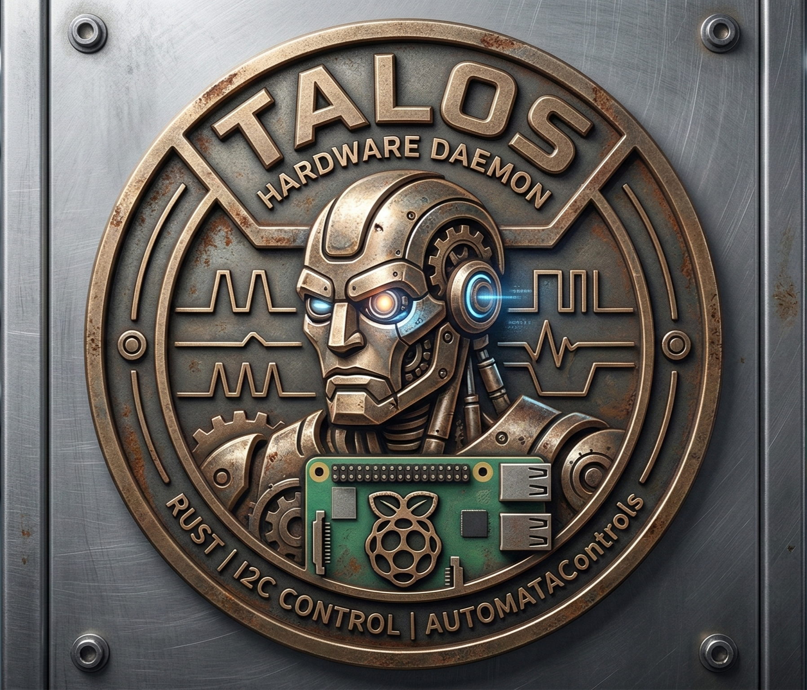

<p align="center">
  
  <br/>
  <strong>NexusEdge Talos Daemon</strong>
</p>

<p align="center">
  <a href="https://github.com/AutomataNexus/NexusEdge_Talos_Daemon/releases"></a>
  
  
  
  
  
  
  
</p>

---


**NexusEdge Talos Daemon** (Talos for short) is a Rust-based hardware + control daemon for Raspberry Pi HVAC controllers. It owns the I2C bus end-to-end, runs the building's control algorithms on-box, and exposes a direct in-process `Arc<Engine>` API when embedded in NexusEdge (zero HTTP overhead). An HTTP API on port `6100` is available for external tools and debugging.

Part of the [NexusEdge](https://automatanexus.com/products/nexusedge) industrial control platform by **AutomataNexus**.

Two roles in one binary (`nexusedge-talos-daemon`):

1. **Hardware I/O** — polls [Sequent Microsystems](https://sequentmicrosystems.com/) HATs every second, caches readings, serializes all writes through a single queue, reports per-channel metrics to the local Aegis-DB.
2. **Control engine** — registers equipment from a hot-reloadable `site.toml`, runs 44 HVAC control algorithms (TMC, PID, lead/lag, cascade, MPC advisory, fan coil, heat pump, pool, greenhouse, natatorium, smart home, commercial lighting, water monitoring, and more), persists run-hours across restarts, and exposes manual overrides + setpoint tuning over REST. Can run standalone or embedded in NexusEdge via `run_embedded()` which returns an `Arc<Engine>` for zero-overhead in-process calls.

## Features

### Hardware I/O
- Polls all enabled Sequent Microsystems boards every 1 s (configurable).
- Caches all readings in a `parking_lot::RwLock` so API reads are sub-ms.
- Dedicated writer thread owns a separate I2C fd — no poller/writer contention.
- Per-cycle soft-timeout warning + I2C retry/backoff.
- GPIO pin support for direct-relay hardware (e.g. Waveshare relay HATs).
- Static musl binaries — no GLIBC dependency, runs on any Bookworm-era ARM Linux.

### Control Engine
- **44 algorithms** — TMC family, PID, linear, on/off, cascade, lead/lag pump/boiler/chiller, DX+CW AHU, DOAS+DX/changeover, electric heat, VAV/VAV-DX, natatorium, greenhouse, steambundle, zone reheat, fan coil (2-way/4-way), heat pump, resi boiler/furnace/heat pump, pool gas heater/heat pump, pressure booster, RTU, smart home, smart garden, commercial lighting, electrical monitor, water monitor (city/well), water-cooled chiller, cooling tower, VFD pump pack, cascade boiler, MPC advisory.
- **Equipment registry** via `site.toml` — inputs, outputs, algorithm params, alarm thresholds declared once in TOML.
- **Hot-reload** — `site.toml` changes are picked up via `notify` without restarting the daemon; control state (cycle counts, integrals, run-hours) is preserved across reloads.
- **Manual overrides** — force any output to a fixed value or release back to the algorithm via REST.
- **Runtime tracker** — per-unit on-time accumulated across restarts via Aegis-DB, so lead/lag changeover and maintenance hours survive reboots.
- **Upstream air coupling** — zone-reheat controllers can be fed `supply_temp` from an upstream AHU via NexusBMS lookup (`incoming_air_source`).

### CLI Commands
```bash
nexusedge-talos-daemon              # Start the daemon
nexusedge-talos-daemon release      # Release safe state (commissioning)
nexusedge-talos-daemon engage       # Engage safe state (emergency stop)
nexusedge-talos-daemon status       # Print control status JSON
nexusedge-talos-daemon help         # Usage
```

### Releases & CI
- **SLSA Provenance Level 3** — all release binaries are attested via `actions/attest-build-provenance`.
- **Multi-arch**: Pi 5 Bookworm aarch64, Pi 4 Bookworm aarch64, Pi 4 Bullseye aarch64, Pi 4 Bullseye armhf, x86_64 Linux.
- **Docker**: Multi-arch images on GHCR (`ghcr.io/automatanexus/talos-daemon`).

### Integrations
- **Aegis-DB** — local per-channel metrics stream (default 5 s interval).
- **NexusEdge** — embedded via `run_embedded()` returning `Arc<Engine>` for zero-overhead in-process control. No HTTP between app and engine.
- **Cloudflare Tunnel** — controllers are addressable from anywhere as `<serial>.automatacontrols.com` when wired through a tunnel.

## Supported Boards

| Board | I2C Base | Channels | Use Case |
|-------|----------|----------|----------|
| **MegaBAS** | `0x48` | 8 AI, 4 AO, 4 triacs, 8 dry contacts, 8× 1K/10K resistance | General HVAC I/O |
| **MegaIND** | `0x50` | 4 voltage in, 4 current in, 4 voltage out, 4 current out, 1-wire bus | Industrial I/O |
| **UnivIn16** | `0x40` | 16 universal inputs (voltage, 1K, 10K) | Large input count |
| **UOut16** | `0x60` | 16 analog outputs (0–10V) | Large output count |
| **RelInd16** | `0x58` | 16 relays | Relay banks |
| **RelInd8** | `0x38` | 8 relays | Relay banks |

Each board type supports stacking up to **8 units** (address = base + stack, 0–7).

## Architecture

```
                    ┌──────────────────────────────────────┐
                    │               main.rs                │
                    │    Loads config, spawns threads,     │
                    │    starts HTTP server + control loop │
                    └───┬────┬────┬────┬────┬────┬────┬────┘
                        │    │    │    │    │    │    │
         ┌──────────────▼┐  ┌▼───┐ ┌▼──▼┐  ┌▼───┐ ┌▼──▼────────┐
         │   poller.rs   │  │writer│ │ctrl │ │site_│ │nexusbms.rs │
         │  (std thread) │  │.rs  │ │engine│ │loader│ │(tokio)    │
         │  Reads I2C    │  │Writes│ │(tokio│ │watch │ │push state│
         │  every 1s     │  │I2C   │ │task) │ │site. │ │pull setp.│
         │  Updates cache│  │from Q│ │Runs  │ │toml  │ │           │
         └──────┬────────┘  └──┬──┘ │algos │ └──┬──┘ └──┬────────┘
                │              │    └──┬──┘    │        │
                │              │       │       │        │
         ┌──────▼──────────────▼───────▼───────▼────────▼────────┐
         │                      cache.rs                          │
         │   SharedCache (parking_lot::RwLock)                    │
         │   HashMap<stack, BoardData> per board type             │
         └────────────────────────────────────────────────────────┘
                │                    │                    │
         ┌──────▼──────┐     ┌───────▼──────┐    ┌────────▼──────┐
         │ aegisdb.rs  │     │  server.rs   │    │ runtime.rs    │
         │ (tokio task)│     │  (tokio)     │    │ run-hour      │
         │ Per-channel │     │  axum HTTP   │    │ accumulator,  │
         │ metrics to  │     │  on :6100    │    │ persisted to  │
         │ local :9090 │     │              │    │ AegisDB       │
         └─────────────┘     └──────────────┘    └───────────────┘
```

**Thread model**
- **Poller** (std thread) — owns one I2C bus fd, reads all enabled boards, updates shared cache.
- **Writer** (std thread) — owns a second I2C bus fd, processes write commands from a `crossbeam-channel`.
- **HTTP server** (tokio) — axum router serves reads from the cache and sends writes to the writer queue.
- **Control engine** (tokio task) — ticks every `poll_interval_ms`, reads cache → runs each equipment's algorithm → emits write commands → updates equipment state visible over `/control/status`.
- **Site loader** (std thread) — watches `site.toml`'s parent dir via `notify`, debounces 500 ms, applies atomic add/update/remove without dropping control state.
- **Aegis-DB reporter** (tokio task) — reads cache every 5 s, batch-inserts hardware metrics.
- **OAT receiver** — accepts outdoor air temperature from NexusEdge via `POST /control/outdoor-temp` (standalone mode) or direct `engine.set_outdoor_temp()` (embedded mode).

## Installation

### Binary

Release binaries for all supported architectures:

```bash
# Pi 5 — Bookworm aarch64
wget https://github.com/AutomataNexus/NexusEdge_Talos_Daemon/releases/latest/download/nexusedge-talos-daemon-pi5-bookworm-aarch64.tar.gz

# Pi 4 — Bookworm aarch64
wget https://github.com/AutomataNexus/NexusEdge_Talos_Daemon/releases/latest/download/nexusedge-talos-daemon-pi4-bookworm-aarch64.tar.gz

# Pi 4 — Bullseye aarch64
# (tag with v*-pi4-bullseye)
wget https://github.com/AutomataNexus/NexusEdge_Talos_Daemon/releases/latest/download/nexusedge-talos-daemon-pi4-bullseye-aarch64.tar.gz

# Pi 4 — Bullseye armhf (32-bit)
# (tag with v*-pi4-bullseye-armhf)
wget https://github.com/AutomataNexus/NexusEdge_Talos_Daemon/releases/latest/download/nexusedge-talos-daemon-pi4-bullseye-armhf.tar.gz

# x86_64 Linux (dev/testing)
wget https://github.com/AutomataNexus/NexusEdge_Talos_Daemon/releases/latest/download/nexusedge-talos-daemon-x86_64-linux.tar.gz
```

```bash
tar xzf nexusedge-talos-daemon-*.tar.gz
sudo mv nexusedge-talos-daemon /usr/local/bin/
sudo chmod +x /usr/local/bin/nexusedge-talos-daemon
```

### Docker

```bash
docker pull ghcr.io/automatanexus/talos-daemon:latest
docker run -d --privileged -v /dev/i2c-1:/dev/i2c-1 -v /etc/nexusedge:/etc/nexusedge -p 6100:6100 ghcr.io/automatanexus/talos-daemon:latest
```

Multi-arch: `linux/amd64` and `linux/arm64` images available.

### systemd unit

```ini
# /etc/systemd/system/nexusedge-talos-daemon.service
[Unit]
Description=NexusEdge Talos Daemon — I2C hardware + HVAC control
After=network-online.target aegisdb.service
Wants=network-online.target

[Service]
Type=simple
ExecStart=/usr/local/bin/nexusedge-talos-daemon
Restart=on-failure
RestartSec=5
User=root
WorkingDirectory=/etc/nexusedge

[Install]
WantedBy=multi-user.target
```

```bash
sudo systemctl daemon-reload
sudo systemctl enable --now nexusedge-talos-daemon
sudo journalctl -u nexusedge-talos-daemon -f
```

> Talos reads `./hardware-daemon.toml` from its working directory, so `WorkingDirectory=/etc/nexusedge` is the canonical layout. `site.toml` sits alongside it.

## Configuration

Two files — both live in `/etc/nexusedge/`:

- **`hardware-daemon.toml`** — I/O surface: which boards, which I2C bus, logging, integrations.
- **`site.toml`** — control surface: equipment list, per-equipment inputs/outputs, algorithm + params. Hot-reloaded.

### `hardware-daemon.toml`

```toml
[server]
host = "127.0.0.1"           # bind to localhost; external reach goes through CF tunnel
port = 6100

[polling]
interval_ms = 1000           # I2C read cycle
timeout_ms  = 500            # soft-timeout warning threshold

[i2c]
bus = 1
retry_count = 3
retry_delay_ms = 10

[logging]
level = "info"               # trace | debug | info | warn | error
file  = "/var/log/nexusedge/hardware-daemon.log"

[boards.megabas]
enabled = true
stacks  = [0, 1]             # one row per stack (DIP switch 0–7)

[boards.megaind]
enabled = false
[boards.univin16]
enabled = false
[boards.uout16]
enabled = false
[boards.relind16]
enabled = false
[boards.relind8]
enabled = false

[aegisdb]
enabled = true
url           = "http://127.0.0.1:9090"
interval_ms   = 5000
node_name     = "warren-b-wing-basement"
equipment_id  = "warren-ahu-3"

[control]
site_path = "/etc/nexusedge/site.toml"     # empty = pure hardware daemon, no control

[gpio]
enabled = false
pins    = []                               # [{ bcm = 5, name = "fan",
                                           #    direction = "output", active_low = true }]
```

### `site.toml` — equipment manifest

Each equipment block declares its I/O pin map, algorithm, and algorithm params. The control engine binds inputs and outputs at startup using `board` / `stack` / `channel` triples against the board cache.

```toml
[site]
name             = "Warren — B Wing Basement"
location         = "Heritage Warren · B Wing Basement Mechroom"
poll_interval_ms = 5000
talos_url        = "http://127.0.0.1:6100"

groups = []

[[equipment]]
id   = "warren-ahu-3"
name = "Warren AHU-3"
type = "ahu"
tags = ["ahu", "4-pipe", "economizer", "hw-coil", "cw-coil"]

[[equipment.inputs]]
name        = "supply_air_temp"
label       = "Supply Air Temp"
board       = "megabas"
stack       = 1
channel     = 2
signal_type = "ntc10k"           # ntc10k | ntc1k | voltage | current | contact | ...
precision   = 1

[equipment.inputs.thresholds]
low_alarm    = 40.0
low_warning  = 48.0
high_warning = 85.0
high_alarm   = 95.0

[[equipment.outputs]]
name        = "hw_valve"
label       = "HW Valve"
board       = "megabas"
stack       = 0
channel     = 1
signal_type = "analog_0_10v"
inverted    = true                # normally-open: 0V = full heat
initial     = 10.0

[equipment.algorithm]
type = "tmc_ahu_lead_lag"

[equipment.algorithm.params]
summer_setpoint = 72.0
winter_setpoint = 70.0
freeze_limit    = 38.0
# ... see `GET /control/algorithms/tmc_ahu_lead_lag/schema` for the full schema
```

Save `site.toml` and the daemon applies the change atomically within ~500 ms — cycle counts, integrals and runtime accumulators are preserved across reloads.

## API Reference

All endpoints on `http://127.0.0.1:6100`. Bind is localhost by default; expose externally via Cloudflare Tunnel or SSH port-forward.

### Health & Cache

```bash
curl http://localhost:6100/health        # daemon + per-board connectivity
curl http://localhost:6100/cache         # full snapshot of all polled values
```

### Control Engine

| Method | Path | Purpose |
|---|---|---|
| `GET`  | `/control/status` | All registered equipment — inputs, outputs, algorithm, state |
| `GET`  | `/control/algorithms` | Catalog of the 20+ algorithms |
| `GET`  | `/control/algorithms/:id/schema` | JSON schema of an algorithm's params |
| `GET`  | `/control/runtime` | All run-hour counters |
| `GET`  | `/control/runtime/:eq/:unit` | Single unit run-hours |
| `POST` | `/control/equipment/:id/param` | Set one algorithm param |
| `POST` | `/control/equipment/:id/params` | Set many algorithm params |
| `POST` | `/control/equipment/:id/enabled` | Enable/disable the equipment |
| `GET`  | `/control/safe-state` | Query safe state (engaged = all outputs idle) |
| `POST` | `/control/safe-state` | Release or engage safe state |
| `POST` | `/control/outdoor-temp` | Set site-level OAT (from NexusEdge weather) |
| `POST` | `/control/site-mode` | Set site mode (summer/winter) |
| `POST` | `/control/equipment/:id/algorithm` | Swap the algorithm at runtime |
| `POST` | `/control/equipment/:id/override/:output` | Manual override — force a value |
| `DELETE` | `/control/equipment/:id/override/:output` | Release override back to algo |
| `GET`  | `/control/equipment/:id/overrides` | List active overrides |

```bash
# Force HW valve to 75% open on Warren AHU-3
curl -X POST http://localhost:6100/control/equipment/warren-ahu-3/override/hw_valve \
  -H "Content-Type: application/json" \
  -d '{"value": 75.0}'

# Release it back to the algorithm
curl -X DELETE http://localhost:6100/control/equipment/warren-ahu-3/override/hw_valve

# Retune the summer setpoint
curl -X POST http://localhost:6100/control/equipment/warren-ahu-3/param \
  -H "Content-Type: application/json" \
  -d '{"key": "summer_setpoint", "value": 74.0}'
```

### Hardware I/O

#### MegaBAS

```bash
curl http://localhost:6100/megabas/analog_inputs?stack=0
curl http://localhost:6100/megabas/analog_outputs?stack=0
curl http://localhost:6100/megabas/contacts?stack=0
curl http://localhost:6100/megabas/triacs?stack=0
curl http://localhost:6100/megabas/resistance_1k?stack=0
curl http://localhost:6100/megabas/resistance_10k?stack=0
curl http://localhost:6100/megabas/cpu_temp?stack=0
curl http://localhost:6100/megabas/supply_voltage?stack=0

curl -X POST http://localhost:6100/megabas/triac \
  -H "Content-Type: application/json" \
  -d '{"stack": 0, "channel": 1, "state": true}'

curl -X POST http://localhost:6100/megabas/analog_output \
  -H "Content-Type: application/json" \
  -d '{"stack": 0, "channel": 2, "value": 5.0}'

# Bulk write all 4 AO channels in a single I2C transaction
curl -X POST http://localhost:6100/megabas/analog_outputs \
  -H "Content-Type: application/json" \
  -d '{"stack": 0, "values": [5.0, 0.0, 7.5, 2.5]}'
```

#### MegaIND

```bash
curl http://localhost:6100/megaind/voltage_inputs?stack=0
curl http://localhost:6100/megaind/current_inputs?stack=0
curl http://localhost:6100/megaind/voltage_outputs?stack=0
curl http://localhost:6100/megaind/current_outputs?stack=0
curl http://localhost:6100/megaind/owb_temperatures?stack=0   # DS18B20 1-wire bus

curl -X POST http://localhost:6100/megaind/voltage_output \
  -H "Content-Type: application/json" \
  -d '{"stack": 0, "channel": 1, "value": 6.0}'

curl -X POST http://localhost:6100/megaind/current_output \
  -H "Content-Type: application/json" \
  -d '{"stack": 0, "channel": 1, "value": 12.0}'   # mA (4–20)
```

#### RelInd16 · RelInd8 · UnivIn16 · UOut16

```bash
curl http://localhost:6100/16relind/relays?stack=0
curl -X POST http://localhost:6100/16relind/relay \
  -H "Content-Type: application/json" \
  -d '{"stack": 0, "channel": 3, "state": true}'

curl http://localhost:6100/8relind/relays?stack=0
curl http://localhost:6100/16univin/voltage?stack=0
curl http://localhost:6100/16univin/resistance_10k?stack=0
curl http://localhost:6100/16uout/outputs?stack=0
curl -X POST http://localhost:6100/16uout/output \
  -H "Content-Type: application/json" \
  -d '{"stack": 0, "channel": 7, "value": 8.0}'
```

#### GPIO (Waveshare / direct-relay HATs)

```bash
curl http://localhost:6100/gpio/pins
curl -X POST http://localhost:6100/gpio/pin \
  -H "Content-Type: application/json" \
  -d '{"bcm": 5, "state": true}'
```

## Control Algorithms

| ID | Description |
|---|---|
| `tmc` | Core TMC temperature-modulation curve (piecewise linear) |
| `tmc_ahu` | Single-pipe AHU using TMC on SAT |
| `tmc_ahu_leadlag` | 4-pipe AHU + HW/CW coils + OA damper + lead/lag CW pumps + weekly changeover |
| `tmc_vav` | VAV box on TMC with damper + reheat |
| `tmc_vav_dx` | VAV box with DX cooling stages |
| `tmc_zone_reheat` | Multi-zone reheat fed by an upstream AHU |
| `tmc_chiller` | Chiller with min-on/off, OAT lockout, condenser post-run |
| `tmc_chiller_simple` | Simplified chiller with flow-switch interlock |
| `tmc_comfort_boiler` | HW comfort-heat boiler staging |
| `tmc_domestic_boiler` | Domestic hot-water boiler |
| `tmc_electric_heat` | Electric heat staging |
| `tmc_greenhouse` | Greenhouse — heat + vent + evap combo |
| `tmc_natatorium` | Pool room — temperature + humidity |
| `tmc_doas_dx` | Direct-fired DOAS + 2-stage DX cooling |
| `tmc_doas_changeover` | DOAS with heating/cooling changeover + DX |
| `tmc_steambundle` | Steam-to-HW heat exchanger with OAT reset |
| `dx_cw_ahu` | DX + CW AHU cooling sequencing |
| `lead_lag` | Generic lead/lag pump with CT-amps proof + failover |
| `lead_lag_boiler` | Lead/lag boilers with pump-prove + pre-start delay |
| `lead_lag_chiller` | Lead/lag chiller rotation + condenser pump |
| `cascade` | Cascade controller (space → SAT reset) |
| `cascade_boiler` | Cascade boiler with lead/lag + OAT reset |
| `pid` | PID with anti-windup + D-on-measurement |
| `linear` | Linear proportional |
| `on_off` | Bang-bang with hysteresis + min-on/off |
| `fan_coil` | Fan coil unit — 2-way or 4-way piping, 3-speed fan |
| `heat_pump` | Heat pump — heat/cool/defrost/aux stages |
| `resi_boiler` | Residential boiler with outdoor lockout |
| `resi_furnace` | Residential furnace — heat + cool stages |
| `resi_heat_pump` | Residential heat pump with emergency heat |
| `rtu` | Rooftop unit — economizer + DX + heat |
| `smart_home` | Whole-home HVAC + lighting + security |
| `smart_garden` | Irrigation + freeze protection + soil moisture |
| `pool_gas_heater` | Pool gas heater with flow interlock |
| `pool_heat_pump` | Pool heat pump with defrost + flow switch |
| `pressure_booster` | Domestic water pressure booster — VFD + lead/lag |
| `cooling_tower` | Cooling tower fan staging + freeze lockout |
| `water_cooled_chiller` | Water-cooled chiller with condenser loop |
| `vfd_pump_pack` | VFD pump pack — pressure control + rotation |
| `commercial_lighting` | Commercial lighting — schedules + demand shed + phase loss |
| `electrical_monitor` | Electrical panel monitor — demand shed + brown-out |
| `water_monitor_city` | City water monitor — leak detection + fixture tracking |
| `water_monitor_well` | Well pump monitor — pressure cut-in/out + dry-well protection |
| `mpc_advisory` | MPC advisory (Pro/Enterprise) — Sobek Apex NPU recommendations |

Each algorithm's full param schema is queryable at `GET /control/algorithms/:id/schema`.

## HVAC Signal Conventions

### Heating Valve (Normally Open)

| Voltage | Position | Heat |
|---------|----------|------|
| 0.00V | 100% OPEN | Maximum heat |
| 5.00V | 50% OPEN | Half heat |
| 10.00V | 0% (CLOSED) | No heat |

**Inverted:** lower voltage = more heat. `voltage = ((100 - heat%) / 100) × 10`

### Cooling Valve (Normally Closed)

| Voltage | Position | Cooling |
|---------|----------|---------|
| 0.00V | 0% (CLOSED) | No cooling |
| 5.00V | 50% OPEN | Half cooling |
| 10.00V | 100% OPEN | Maximum cooling |

`voltage = (cool% / 100) × 10`

### NTC Thermistor Conversion

Talos returns raw resistance in ohms on `/megabas/resistance_10k` (and the `ntc10k` signal type in `site.toml`). Convert with Steinhart-Hart:

```javascript
// 10K NTC Type 2 (Beta = 3950)
const T0 = 298.15, R0 = 10000, B = 3950;
const tempK = 1 / (1/T0 + (1/B) * Math.log(ohms / R0));
const tempF = (tempK - 273.15) * 9/5 + 32;
```

| Resistance | Temperature |
|------------|-------------|
| 30K Ω | ~33°F |
| 10K Ω | ~77°F (25°C) |
| 5K Ω | ~110°F |

The control engine does this conversion internally when an input declares `signal_type = "ntc10k"` — the algorithm sees temperature in °F directly.

## Troubleshooting

### GLIBC version errors on older Raspberry Pi OS

If you see `GLIBC_2.38 not found` (typical on Bookworm-era Pi with glibc 2.36) the binary was built on a newer host. The official releases are statically linked against **musl** (`aarch64-unknown-linux-musl` / `armv7-unknown-linux-musleabihf`) and have no GLIBC dependency. Grab the release binary rather than cross-compiling for the `gnu` target.

### I2C bus not found

```bash
sudo raspi-config nonint do_i2c 0 && sudo reboot
i2cdetect -y 1            # should list devices at 0x38/0x40/0x48/0x50/0x58/0x60 per enabled boards
```

### Cache returns empty

- Verify DIP-switch settings on each HAT match `stacks = [...]` in `hardware-daemon.toml`.
- `journalctl -u nexusedge-talos-daemon -f` — missing boards surface as `Remote I/O error` on the first poll.
- Reseat the stacked board physically; a half-mated HAT is the #1 root cause.

### CLI vs daemon values

The Sequent `megabas` CLI reads the same registers but with different units for resistance:

```bash
megabas 0 adcrd 1         # voltage, compare with /megabas/analog_inputs
megabas 0 r10krd 1        # kΩ — multiply by 1000 for daemon's Ω
```

### Control engine ignores a site.toml edit

- Edit must atomically replace the file (most editors do this with `write + rename`). `echo >> site.toml` in-place can race — prefer `$EDITOR` or `install -m 644`.
- Check `journalctl` for `site.toml hot-reloaded: +N ~M -K` — if you don't see it, the watcher didn't fire.
- A TOML parse error leaves the previous engine state intact and logs the error — the daemon never crashes on a bad site.toml.

### Run-hours reset after a restart

Aegis-DB must be reachable at `[aegisdb].url` **at startup** — the runtime tracker loads its accumulator from the last persisted row. Verify with:

```bash
curl http://localhost:9090/health           # AegisDB up?
curl http://localhost:6100/control/runtime  # should list non-zero hours for any unit that's been running
```

---

<p align="center">
  
  <br/>
  <sub>Built by <strong>AutomataNexus, LLC</strong></sub>
  <br/>
  <sub>© 2026 AutomataNexus. All rights reserved.</sub>
</p>
